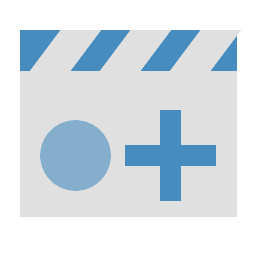

# Movie Maker Plus

A powerful enhancement for Godot 4's Movie Maker mode that adds timestamps, dedicated output folders, and automatic MP4 conversion.

Created by **nooitaf**. Originally based on Movie Maker Timestamp by Tim Krief.

## Features

*   **Automatic Timestamps:** Every recording gets a fresh timestamp (e.g., `my_movie-2024-04-19_16.36.13.avi`), preventing accidental overwrites.
*   **Structured Output:** Dedicated settings for Output Folder and Base Filename. No more messing with a single long path string.
*   **MP4 Conversion:** Automatically trigger FFmpeg to convert your recordings to MP4 the moment you stop the game.
*   **On-the-Fly Generation:** Timestamps are generated in real-time right before you start recording.
*   **Silent Operation:** The plugin remains completely silent and inactive unless **Movie Maker Mode** is toggled on in the editor.

## Install

To use the plugin in your own project:
1. Copy the `addons/movie_maker_plus/` folder to the `addons/` folder of your project.
2. Enable the plugin in **Project > Project Settings > Plugins**.

## How to use

After enabling the plugin, go to **Project Settings** and navigate to **Editor > Movie Writer**. You will find a new **Movie Maker Plus** section at the bottom.

1.  **Output Folder:** Choose where you want your movies saved (defaults to your project root).
2.  **File Base Name:** Enter the name of your movie (defaults to your project name in `snake_case`).
3.  **Output Format:** Choose between `avi`, `ogv`, or `png`.
4.  **Auto Convert to MP4:** If you have FFmpeg installed, check this to automatically generate an MP4 file after each recording.

## Requirements

*   **Godot 4.x** (Tested on 4.0 through 4.6.2+)
*   **FFmpeg** (Optional: Required only for the "Auto Convert to MP4" feature)
